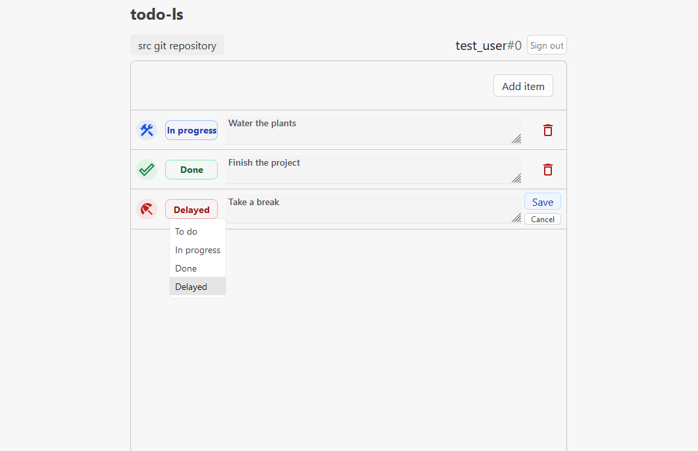

# todo-ls (Todo List)

## Description
todo-ls is a simple web app for organizing tasks/todo items - a todo list app.

todo-ls consists of backend and frontend projects. SQL database is used to store item and user data.

## Demo / Setup
The app is currently not running on any instance. However, you can just run `start-app.sh` script to get the whole app running and accessible from the browser. Only docker is required.

## Source code repositories
[todo-ls backend](https://github.com/H36615/todo-ls-backend)

[todo-ls frontend](https://github.com/H36615/todo-ls-frontend)
